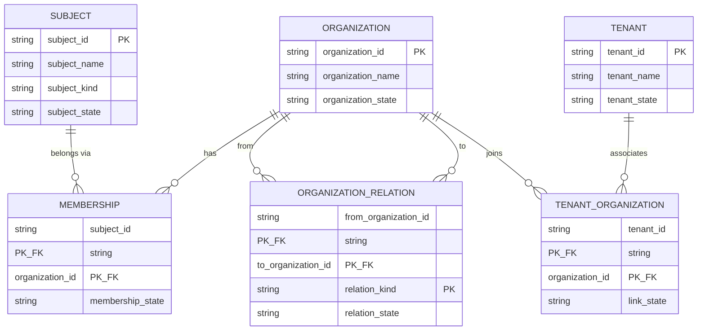

# ER diagram & cardinality / ER 图与基数

O1 freeze — logical model only. Physical DDL is O2.  
O1 冻结——仅逻辑模型。物理 DDL 属 O2。

## Mermaid ER



**Notes / 说明**

- `SUBJECT` already exists (`subject` table, V1). O1 does not redefine account / identity.
- `TENANT` already exists (`tenant` table, V1).
- `ORGANIZATION` has **no** `tenant_id` column — tenant association is only via `TENANT_ORGANIZATION`.
- `MEMBERSHIP` has **no** `tenant_id` — tenant is never inferred from membership alone for authorization.
- Hierarchy is **not** a parent_id on Organization; it is `ORGANIZATION_RELATION` with kind `CONTAINS` (and future kinds only when product-proven).

## Cardinality table / 基数表

| From | To | Cardinality | Rule |
| --- | --- | --- | --- |
| Subject | Membership | 0..* | Subject may exist with zero memberships |
| Organization | Membership | 0..* | Org may exist with zero members |
| Membership | Subject | 1 | Must reference existing Subject |
| Membership | Organization | 1 | Must reference existing Organization |
| Organization | OrganizationRelation (from) | 0..* | Self-edge forbidden |
| Organization | OrganizationRelation (to) | 0..* | CONTAINS graph must be acyclic |
| Tenant | TenantOrganization | 0..* | Tenant may exist with zero orgs |
| Organization | TenantOrganization | 0..* | Org may exist with zero tenants; may join many tenants |
| TenantOrganization | Permission | — | **Never grants permission** |

## Explicit non-edges / 明确不存在的边

| Forbidden | Why |
| --- | --- |
| Membership → Tenant | Membership carries no tenant semantics |
| Organization.parent_id | Hierarchy only via OrganizationRelation |
| TenantOrganization → AccessDecision | Relationship ≠ authorization |
| Auto-merge Organization across tenants | Same display name in two tenants stays two orgs |

## Layer diagram / 分层图

```text
Subject            Organization             Tenant
   │                    │                      │
   │                describes               defines
   │                social world         digital space
   │                    │                      │
   └── Membership ──────┘                      │
                        │                      │
                        └── TenantOrganization ┘

Organization
     │
OrganizationRelation (CONTAINS, …)
     ↓
Organization
```
